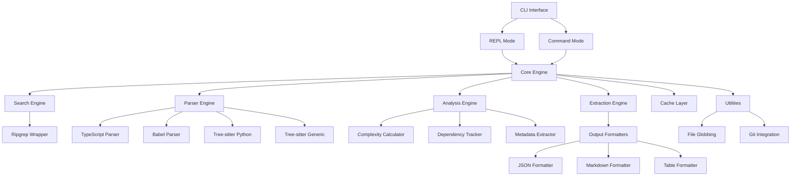

# Design Document

## Overview

코드베이스 검색 및 분석을 위한 Node.js 기반 CLI 도구의 설계 문서입니다. 이 시스템은 텍스트 검색, AST 기반 구조 분석, 메타데이터 추출을 통합하여 개발자와 LLM 에이전트가 효율적으로 코드를 탐색할 수 있도록 지원합니다.

시스템은 모듈러 아키텍처를 채택하여 REPL 모드와 CLI 모드를 모두 지원하며, 다양한 프로그래밍 언어와 출력 포맷을 확장 가능한 방식으로 처리합니다.

## Architecture

### High-Level Architecture



### Layer Architecture

1. **Interface Layer**: CLI 진입점과 REPL 인터페이스
2. **Core Layer**: 비즈니스 로직과 워크플로우 조정
3. **Engine Layer**: 검색, 파싱, 분석, 추출 엔진
4. **Provider Layer**: 언어별 파서와 외부 도구 래퍼
5. **Utility Layer**: 캐싱, 파일 시스템, Git 통합

## Components and Interfaces

### Core Engine

```typescript
interface CoreEngine {
  search(query: SearchQuery): Promise<SearchResult[]>
  analyze(target: AnalysisTarget): Promise<AnalysisResult>
  extract(location: CodeLocation): Promise<CodeExtraction>
}

interface SearchQuery {
  pattern: string
  type: 'text' | 'function' | 'class' | 'import'
  filePattern?: string
  language?: string
  options: SearchOptions
}

interface SearchOptions {
  caseSensitive?: boolean
  regex?: boolean
  contextLines?: number
  maxResults?: number
}
```

### Parser Engine

```typescript
interface ParserEngine {
  parse(filePath: string): Promise<AST>
  findFunctions(ast: AST): FunctionNode[]
  findClasses(ast: AST): ClassNode[]
  findImports(ast: AST): ImportNode[]
  extractRange(ast: AST, startLine: number, endLine: number): CodeNode
}

interface LanguageParser {
  canParse(filePath: string): boolean
  parse(content: string): Promise<AST>
  extractMetadata(node: CodeNode): NodeMetadata
}
```

### Analysis Engine

```typescript
interface AnalysisEngine {
  calculateComplexity(node: FunctionNode): ComplexityMetrics
  analyzeDependencies(filePath: string): DependencyGraph
  extractDocumentation(node: CodeNode): Documentation
  getCallGraph(functionName: string): CallGraph
}

interface ComplexityMetrics {
  cyclomaticComplexity: number
  linesOfCode: number
  cognitiveComplexity: number
  maintainabilityIndex: number
}
```

### Output Formatters

```typescript
interface OutputFormatter {
  format(data: any): string
  supports(format: OutputFormat): boolean
}

type OutputFormat = 'json' | 'markdown' | 'table' | 'colored'

interface FormattedOutput {
  content: string
  metadata: {
    format: OutputFormat
    timestamp: Date
    resultCount: number
  }
}
```

## Data Models

### Search Result Model

```typescript
interface SearchResult {
  file: string
  type: 'function' | 'class' | 'variable' | 'text'
  name?: string
  startLine: number
  endLine: number
  content: string
  context?: {
    before: string[]
    after: string[]
  }
  metadata: ResultMetadata
}

interface ResultMetadata {
  language: string
  signature?: string
  complexity?: number
  dependencies?: string[]
  documentation?: string
}
```

### AST Node Models

```typescript
interface CodeNode {
  type: NodeType
  name: string
  startLine: number
  endLine: number
  content: string
  children: CodeNode[]
  metadata: NodeMetadata
}

interface FunctionNode extends CodeNode {
  parameters: Parameter[]
  returnType?: string
  isAsync: boolean
  isExported: boolean
}

interface ClassNode extends CodeNode {
  methods: FunctionNode[]
  properties: PropertyNode[]
  extends?: string
  implements?: string[]
}

interface ImportNode extends CodeNode {
  source: string
  imports: ImportSpecifier[]
  isDefault: boolean
}
```

### Configuration Model

```typescript
interface Config {
  search: {
    defaultContextLines: number
    maxResults: number
    excludePatterns: string[]
  }
  parsing: {
    enabledLanguages: string[]
    parserOptions: Record<string, any>
  }
  cache: {
    enabled: boolean
    ttl: number
    maxSize: number
  }
  output: {
    defaultFormat: OutputFormat
    colorEnabled: boolean
  }
}
```

## Error Handling

### Error Types

```typescript
class CodeSearchError extends Error {
  constructor(
    message: string,
    public code: ErrorCode,
    public context?: any
  ) {
    super(message)
  }
}

enum ErrorCode {
  PARSE_ERROR = 'PARSE_ERROR',
  FILE_NOT_FOUND = 'FILE_NOT_FOUND',
  UNSUPPORTED_LANGUAGE = 'UNSUPPORTED_LANGUAGE',
  SEARCH_TIMEOUT = 'SEARCH_TIMEOUT',
  INVALID_QUERY = 'INVALID_QUERY',
  CACHE_ERROR = 'CACHE_ERROR'
}
```

### Error Handling Strategy

1. **Graceful Degradation**: 파싱 실패 시 텍스트 검색으로 fallback
2. **Retry Logic**: 일시적 오류에 대한 재시도 메커니즘
3. **User-Friendly Messages**: 기술적 오류를 사용자 친화적 메시지로 변환
4. **Logging**: 디버깅을 위한 상세 로그 기록

```typescript
class ErrorHandler {
  static handle(error: Error, context: string): HandledError {
    if (error instanceof CodeSearchError) {
      return this.handleKnownError(error, context)
    }
    return this.handleUnknownError(error, context)
  }
  
  static async withFallback<T>(
    primary: () => Promise<T>,
    fallback: () => Promise<T>
  ): Promise<T> {
    try {
      return await primary()
    } catch (error) {
      console.warn('Primary operation failed, using fallback:', error.message)
      return await fallback()
    }
  }
}
```

## Testing Strategy

### Unit Testing

- **Parser Tests**: 각 언어 파서의 정확성 검증
- **Search Tests**: 다양한 검색 패턴과 옵션 테스트
- **Analysis Tests**: 복잡도 계산과 의존성 분석 검증
- **Formatter Tests**: 출력 포맷의 정확성 확인

### Integration Testing

- **End-to-End Workflows**: REPL과 CLI 모드의 전체 워크플로우
- **Multi-Language Support**: 다양한 언어 파일의 통합 처리
- **Performance Tests**: 대규모 코드베이스에서의 성능 검증

### Test Data Strategy

```typescript
// fixtures/ 디렉토리 구조
fixtures/
├── javascript/
│   ├── simple-function.js
│   ├── complex-class.js
│   └── module-imports.js
├── typescript/
│   ├── generic-types.ts
│   ├── decorators.ts
│   └── interfaces.ts
├── python/
│   ├── basic-class.py
│   └── async-functions.py
└── mixed-project/
    ├── src/
    └── tests/
```

### Performance Benchmarks

```typescript
interface PerformanceBenchmark {
  name: string
  fileCount: number
  expectedTime: number // milliseconds
  memoryLimit: number // MB
}

const benchmarks: PerformanceBenchmark[] = [
  {
    name: 'Small Project',
    fileCount: 100,
    expectedTime: 100,
    memoryLimit: 50
  },
  {
    name: 'Medium Project',
    fileCount: 1000,
    expectedTime: 500,
    memoryLimit: 100
  },
  {
    name: 'Large Project',
    fileCount: 10000,
    expectedTime: 1000,
    memoryLimit: 200
  }
]
```

### Mocking Strategy

- **File System**: 가상 파일 시스템으로 테스트 격리
- **External Tools**: ripgrep과 같은 외부 도구 모킹
- **Git Integration**: Git 명령어 모킹으로 일관된 테스트 환경

```typescript
class MockFileSystem {
  private files: Map<string, string> = new Map()
  
  addFile(path: string, content: string): void {
    this.files.set(path, content)
  }
  
  readFile(path: string): string {
    const content = this.files.get(path)
    if (!content) throw new Error(`File not found: ${path}`)
    return content
  }
}
```

이 설계는 확장 가능하고 유지보수가 용이한 아키텍처를 제공하며, 요구사항에서 명시된 모든 기능을 지원할 수 있도록 구성되었습니다.