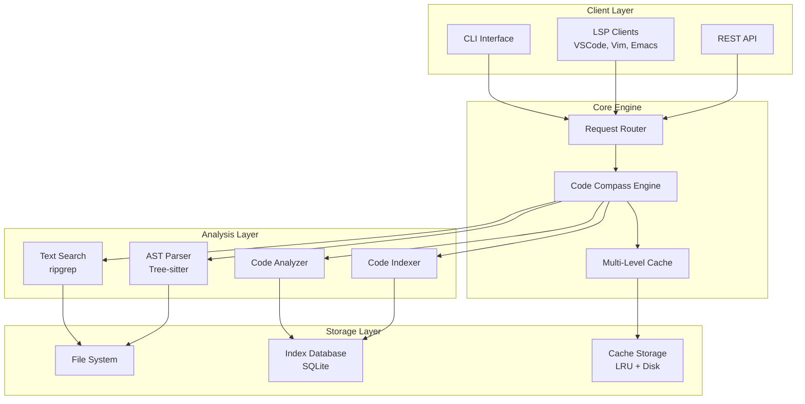
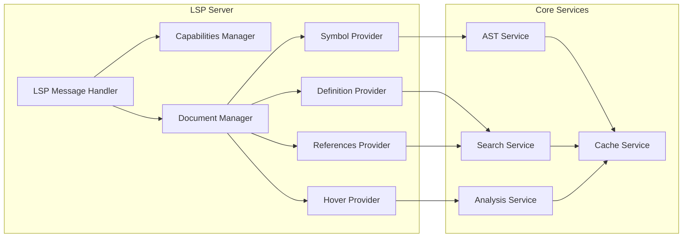

# Design Document - Phase II: LSP & AST Integration

## Overview

Phase II transforms Code Compass into a comprehensive code intelligence platform by implementing a Language Server Protocol (LSP) server and advanced AST analysis capabilities. The design focuses on creating a unified architecture that can serve multiple interfaces (CLI, LSP, API) while maintaining high performance and extensibility.

The core innovation is the integration of fast text search (ripgrep) with deep structural understanding (Tree-sitter AST parsing) and intelligent caching to provide sub-second response times for complex code analysis queries.

## Architecture

### High-Level System Architecture



### LSP Server Architecture



## Components and Interfaces

### 1. LSP Server Component

```typescript
interface LSPServer {
  // Core LSP capabilities
  capabilities: LSPCapabilities;
  
  // Document lifecycle management
  documentManager: DocumentManager;
  
  // Feature providers
  providers: {
    hover: HoverProvider;
    definition: DefinitionProvider;
    references: ReferencesProvider;
    documentSymbol: DocumentSymbolProvider;
    workspaceSymbol: WorkspaceSymbolProvider;
    completion: CompletionProvider;
    codeAction: CodeActionProvider;
    codeLens: CodeLensProvider;
  };
  
  // Server lifecycle
  start(options: LSPServerOptions): Promise<void>;
  stop(): Promise<void>;
  
  // Message handling
  handleMessage(message: LSPMessage): Promise<LSPResponse>;
}

interface LSPCapabilities {
  textDocumentSync: TextDocumentSyncKind;
  hoverProvider: boolean;
  definitionProvider: boolean;
  referencesProvider: boolean;
  documentSymbolProvider: boolean;
  workspaceSymbolProvider: boolean;
  completionProvider?: CompletionOptions;
  codeActionProvider?: CodeActionOptions;
  codeLensProvider?: CodeLensOptions;
  
  // Custom Code Compass capabilities
  experimental?: {
    codeMetrics: boolean;
    semanticSearch: boolean;
    structuralPatterns: boolean;
  };
}
```

### 2. AST Parser Component

```typescript
interface ASTParser {
  // Multi-language parsing
  parsers: Map<Language, TreeSitterParser>;
  
  // Parse operations
  parseFile(filePath: string): Promise<ParsedAST>;
  parseContent(content: string, language: Language): Promise<ParsedAST>;
  
  // Incremental parsing
  updateAST(ast: ParsedAST, changes: TextChange[]): Promise<ParsedAST>;
  
  // Query operations
  query(ast: ParsedAST, query: ASTQuery): ASTNode[];
  findNodes(ast: ParsedAST, nodeType: NodeType): ASTNode[];
  
  // Language detection
  detectLanguage(filePath: string): Language;
  
  // Parser management
  registerParser(language: Language, parser: TreeSitterParser): void;
  getSupportedLanguages(): Language[];
}

interface ParsedAST {
  language: Language;
  filePath: string;
  content: string;
  tree: TreeSitterTree;
  hash: string;
  timestamp: number;
  
  // Cached queries
  symbols?: Symbol[];
  imports?: ImportStatement[];
  exports?: ExportStatement[];
  functions?: FunctionDeclaration[];
  classes?: ClassDeclaration[];
}

interface ASTQuery {
  pattern: string;
  language?: Language;
  captures?: string[];
  predicates?: QueryPredicate[];
}
```

### 3. Code Analysis Component

```typescript
interface CodeAnalyzer {
  // Complexity analysis
  calculateComplexity(ast: ParsedAST): ComplexityMetrics;
  
  // Dependency analysis
  analyzeDependencies(ast: ParsedAST): DependencyGraph;
  
  // Code metrics
  calculateMetrics(ast: ParsedAST): CodeMetrics;
  
  // Pattern detection
  detectPatterns(ast: ParsedAST, patterns: Pattern[]): PatternMatch[];
  
  // Code smells
  detectCodeSmells(ast: ParsedAST): CodeSmell[];
  
  // Symbol analysis
  analyzeSymbol(symbol: Symbol, context: AnalysisContext): SymbolAnalysis;
}

interface ComplexityMetrics {
  cyclomatic: number;
  cognitive: number;
  halstead: HalsteadMetrics;
  maintainability: number;
  nesting: number;
}

interface CodeMetrics {
  linesOfCode: number;
  complexity: ComplexityMetrics;
  dependencies: DependencyMetrics;
  testCoverage?: number;
  documentation?: DocumentationMetrics;
}

interface SymbolAnalysis {
  symbol: Symbol;
  references: Reference[];
  complexity: ComplexityMetrics;
  dependencies: Dependency[];
  documentation?: string;
  usagePatterns: UsagePattern[];
}
```

### 4. Caching System

```typescript
interface CacheSystem {
  // Multi-level cache
  levels: {
    memory: MemoryCache;
    disk: DiskCache;
    distributed?: DistributedCache;
  };
  
  // Cache operations
  get<T>(key: string): Promise<T | null>;
  set<T>(key: string, value: T, ttl?: number): Promise<void>;
  invalidate(key: string): Promise<void>;
  invalidatePattern(pattern: string): Promise<void>;
  
  // Cache management
  clear(): Promise<void>;
  getStats(): CacheStats;
  
  // File-based invalidation
  invalidateFile(filePath: string): Promise<void>;
  invalidateDirectory(dirPath: string): Promise<void>;
}

interface CacheStats {
  hitRate: number;
  missRate: number;
  evictionCount: number;
  memoryUsage: number;
  diskUsage: number;
  entryCount: number;
}
```

### 5. Plugin System

```typescript
interface PluginSystem {
  // Plugin management
  loadPlugin(pluginPath: string): Promise<Plugin>;
  unloadPlugin(pluginName: string): Promise<void>;
  getLoadedPlugins(): Plugin[];
  
  // Plugin lifecycle
  initializePlugins(): Promise<void>;
  shutdownPlugins(): Promise<void>;
  
  // Plugin communication
  callPlugin(pluginName: string, method: string, args: any[]): Promise<any>;
  broadcastEvent(event: PluginEvent): Promise<void>;
}

interface Plugin {
  name: string;
  version: string;
  description: string;
  
  // Lifecycle hooks
  onLoad?(): Promise<void>;
  onUnload?(): Promise<void>;
  onFileChange?(filePath: string): Promise<void>;
  
  // Feature extensions
  commands?: Map<string, CommandHandler>;
  analyzers?: Map<string, Analyzer>;
  parsers?: Map<Language, TreeSitterParser>;
  
  // LSP extensions
  lspProviders?: {
    hover?: HoverProvider;
    completion?: CompletionProvider;
    codeAction?: CodeActionProvider;
  };
}
```

## Data Models

### Core Data Structures

```typescript
// Symbol representation
interface Symbol {
  name: string;
  kind: SymbolKind;
  location: Location;
  range: Range;
  selectionRange: Range;
  detail?: string;
  documentation?: string;
  deprecated?: boolean;
  tags?: SymbolTag[];
  
  // Code Compass extensions
  complexity?: ComplexityMetrics;
  references?: Reference[];
  dependencies?: Dependency[];
}

// Location and positioning
interface Location {
  uri: string;
  range: Range;
}

interface Range {
  start: Position;
  end: Position;
}

interface Position {
  line: number;
  character: number;
}

// Search results
interface SearchResult {
  location: Location;
  content: string;
  context: string[];
  score: number;
  metadata: SearchMetadata;
}

interface SearchMetadata {
  fileType: string;
  language: Language;
  symbolType?: SymbolKind;
  complexity?: number;
  lastModified: Date;
}

// AST nodes
interface ASTNode {
  type: string;
  range: Range;
  text: string;
  children: ASTNode[];
  parent?: ASTNode;
  
  // Language-specific properties
  properties: Map<string, any>;
  
  // Navigation helpers
  findChild(type: string): ASTNode | null;
  findChildren(type: string): ASTNode[];
  findAncestor(type: string): ASTNode | null;
}
```

### Configuration Models

```typescript
interface CodeCompassConfig {
  // General settings
  workspace: WorkspaceConfig;
  
  // LSP settings
  lsp: LSPConfig;
  
  // Parser settings
  parsers: ParserConfig;
  
  // Cache settings
  cache: CacheConfig;
  
  // Analysis settings
  analysis: AnalysisConfig;
  
  // Plugin settings
  plugins: PluginConfig;
}

interface LSPConfig {
  enabled: boolean;
  port?: number;
  stdio: boolean;
  logLevel: LogLevel;
  capabilities: LSPCapabilities;
  
  // Performance tuning
  maxConcurrentRequests: number;
  responseTimeout: number;
  documentSyncMode: TextDocumentSyncKind;
}

interface ParserConfig {
  languages: Language[];
  treeSitterPath?: string;
  parseTimeout: number;
  maxFileSize: number;
  
  // Language-specific settings
  languageSettings: Map<Language, LanguageConfig>;
}

interface CacheConfig {
  enabled: boolean;
  memoryLimit: number;
  diskLimit: number;
  ttl: number;
  
  // Cache strategies
  astCaching: boolean;
  searchCaching: boolean;
  metricsCaching: boolean;
}
```

## Error Handling

### Error Classification

```typescript
enum ErrorType {
  // System errors
  SYSTEM_ERROR = 'system_error',
  FILE_NOT_FOUND = 'file_not_found',
  PERMISSION_DENIED = 'permission_denied',
  
  // Parsing errors
  PARSE_ERROR = 'parse_error',
  UNSUPPORTED_LANGUAGE = 'unsupported_language',
  SYNTAX_ERROR = 'syntax_error',
  
  // LSP errors
  LSP_CONNECTION_ERROR = 'lsp_connection_error',
  LSP_REQUEST_TIMEOUT = 'lsp_request_timeout',
  LSP_INVALID_REQUEST = 'lsp_invalid_request',
  
  // Analysis errors
  ANALYSIS_TIMEOUT = 'analysis_timeout',
  COMPLEXITY_OVERFLOW = 'complexity_overflow',
  
  // Cache errors
  CACHE_ERROR = 'cache_error',
  CACHE_CORRUPTION = 'cache_corruption',
}

interface CodeCompassError extends Error {
  type: ErrorType;
  code: string;
  details?: any;
  recoverable: boolean;
  suggestions?: string[];
}
```

### Error Recovery Strategies

```typescript
interface ErrorRecoveryStrategy {
  // Graceful degradation
  fallbackToTextSearch(): Promise<SearchResult[]>;
  skipCorruptedFiles(): Promise<void>;
  usePartialResults(): Promise<any>;
  
  // Retry mechanisms
  retryWithBackoff(operation: () => Promise<any>, maxRetries: number): Promise<any>;
  retryWithDifferentParser(filePath: string): Promise<ParsedAST>;
  
  // Resource cleanup
  cleanupCorruptedCache(): Promise<void>;
  releaseMemoryOnError(): Promise<void>;
  
  // User notification
  notifyUser(error: CodeCompassError): void;
  suggestFix(error: CodeCompassError): string[];
}
```

## Testing Strategy

### Unit Testing

```typescript
// Parser testing
describe('ASTParser', () => {
  test('should parse TypeScript files correctly', async () => {
    const parser = new ASTParser();
    const ast = await parser.parseFile('test.ts');
    
    expect(ast.language).toBe(Language.TypeScript);
    expect(ast.tree).toBeDefined();
    expect(ast.symbols).toHaveLength(5);
  });
  
  test('should handle syntax errors gracefully', async () => {
    const parser = new ASTParser();
    const result = await parser.parseContent('invalid syntax', Language.TypeScript);
    
    expect(result.errors).toBeDefined();
    expect(result.tree).toBeNull();
  });
});

// LSP testing
describe('LSPServer', () => {
  test('should respond to hover requests', async () => {
    const server = new LSPServer();
    const response = await server.handleHover({
      textDocument: { uri: 'file:///test.ts' },
      position: { line: 10, character: 5 }
    });
    
    expect(response.contents).toBeDefined();
    expect(response.range).toBeDefined();
  });
});
```

### Integration Testing

```typescript
// End-to-end LSP testing
describe('LSP Integration', () => {
  test('should provide definition across files', async () => {
    const workspace = await createTestWorkspace();
    const server = new LSPServer();
    await server.initialize(workspace);
    
    const definition = await server.gotoDefinition({
      textDocument: { uri: 'file:///src/main.ts' },
      position: { line: 5, character: 10 }
    });
    
    expect(definition.uri).toBe('file:///src/utils.ts');
    expect(definition.range.start.line).toBe(15);
  });
});

// Performance testing
describe('Performance', () => {
  test('should index large codebase within time limit', async () => {
    const startTime = Date.now();
    const indexer = new CodeIndexer();
    
    await indexer.indexDirectory('./large-project');
    
    const duration = Date.now() - startTime;
    expect(duration).toBeLessThan(30000); // 30 seconds
  });
});
```

### Load Testing

```typescript
// Concurrent request handling
describe('Load Testing', () => {
  test('should handle multiple concurrent LSP requests', async () => {
    const server = new LSPServer();
    const requests = Array(100).fill(0).map(() => 
      server.handleHover({
        textDocument: { uri: 'file:///test.ts' },
        position: { line: Math.floor(Math.random() * 100), character: 0 }
      })
    );
    
    const responses = await Promise.all(requests);
    expect(responses).toHaveLength(100);
    responses.forEach(response => {
      expect(response).toBeDefined();
    });
  });
});
```

## Performance Considerations

### Optimization Strategies

1. **Incremental Parsing**
   - Only reparse changed portions of files
   - Use Tree-sitter's incremental parsing capabilities
   - Maintain parse trees in memory for active files

2. **Smart Caching**
   - Multi-level cache (memory → disk → distributed)
   - Content-based cache keys using file hashes
   - Automatic cache invalidation on file changes

3. **Lazy Loading**
   - Load AST details only when requested
   - Stream large search results
   - Paginate symbol lists for large files

4. **Parallel Processing**
   - Parse multiple files concurrently
   - Use worker threads for CPU-intensive operations
   - Implement request queuing for LSP operations

### Memory Management

```typescript
interface MemoryManager {
  // Memory monitoring
  getCurrentUsage(): MemoryUsage;
  setMemoryLimit(limit: number): void;
  
  // Cleanup strategies
  evictLRUEntries(): void;
  compactCache(): void;
  releaseUnusedASTs(): void;
  
  // Memory pressure handling
  onMemoryPressure(callback: () => void): void;
  handleOutOfMemory(): void;
}

interface MemoryUsage {
  total: number;
  used: number;
  available: number;
  cacheSize: number;
  astSize: number;
}
```

## Security Considerations

### Input Validation

```typescript
interface SecurityValidator {
  // File path validation
  validateFilePath(path: string): boolean;
  sanitizePath(path: string): string;
  
  // Query validation
  validateQuery(query: string): boolean;
  sanitizeQuery(query: string): string;
  
  // LSP message validation
  validateLSPMessage(message: any): boolean;
  
  // Resource limits
  enforceResourceLimits(operation: string): boolean;
}
```

### Access Control

- Restrict file system access to workspace boundaries
- Validate all file paths to prevent directory traversal
- Implement rate limiting for LSP requests
- Sanitize all user inputs and queries
- Log security-relevant events for auditing

## Deployment Architecture

### Standalone LSP Server

```bash
# Direct LSP server execution
code-compass lsp --stdio --workspace /path/to/project

# TCP mode for remote development
code-compass lsp --port 7777 --host 0.0.0.0
```

### IDE Integration

```json
// VSCode settings.json
{
  "codeCompass.lsp.enabled": true,
  "codeCompass.lsp.serverPath": "/usr/local/bin/code-compass",
  "codeCompass.features": {
    "hover": true,
    "definition": true,
    "references": true,
    "codeMetrics": true
  }
}
```

### Docker Deployment

```dockerfile
FROM node:18-alpine
WORKDIR /app
COPY . .
RUN npm install && npm run build
EXPOSE 7777
CMD ["node", "dist/lsp-server.js", "--port", "7777"]
```

This design provides a solid foundation for implementing the Phase II features while maintaining extensibility and performance. The modular architecture allows for incremental development and testing of individual components.