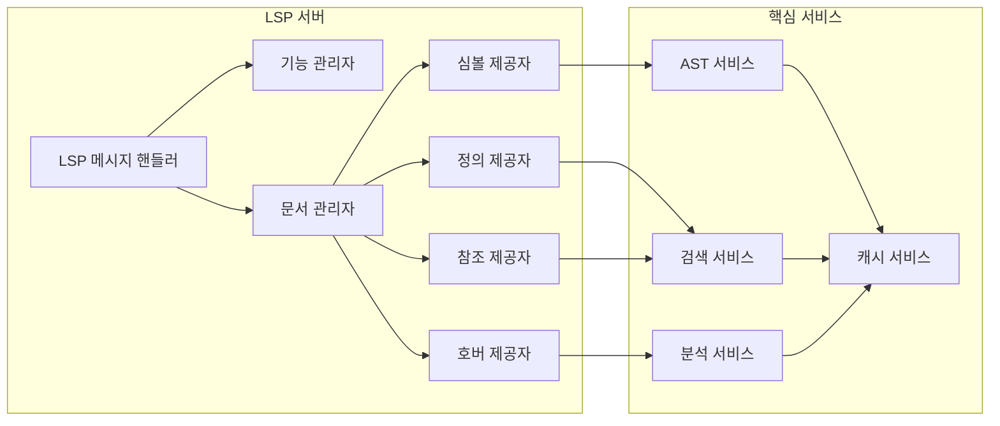

# Code Compass 기술 문서

## 아키텍처 개요

Code Compass는 다계층 아키텍처를 채택하여 기능별로 명확하게 분리되어 있습니다. 시스템은 CLI 인터페이스, 핵심 엔진, 파서 계층, 유틸리티 계층으로 구성됩니다.

### 고수준 시스템 아키텍처

```
┌─────────────────────────────────────────────────────────┐
│                    Code Compass 코어 엔진                │
├─────────────────────────────────────────────────────────┤
│                                                          │
│  ┌────────────┐  ┌────────────┐  ┌────────────┐       │
│  │   파서     │  │  분석기    │  │  캐시 시스템 │       │
│  │   계층     │  │   계층     │  │    계층     │       │
│  └─────┬──────┘  └─────┬──────┘  └─────┬──────┘       │
│        │                │                │               │
│  ┌─────▼────────────────▼────────────────▼──────┐      │
│  │              통합 AST 표현                   │      │
│  └────────────────────┬──────────────────────────┘      │
│                       │                                  │
│  ┌────────────────────▼──────────────────────────┐      │
│  │              쿼리 및 검색 엔진                │      │
│  │  ├─ 텍스트 검색 (ripgrep)                     │      │
│  │  ├─ AST 쿼리 (tree-sitter)                   │      │
│  │  ├─ 시맨틱 검색 (임베딩)                     │      │
│  │  └─ 하이브리드 검색                         │      │
│  └────────────────────┬──────────────────────────┘      │
│                       │                                  │
└───────────────────────┼──────────────────────────────────┘
                        │
        ┌───────────────┼───────────────┐
        │               │               │
   ┌────▼────┐    ┌────▼────┐    ┌────▼────┐
   │   CLI   │    │   LSP   │    │   API   │
   │인터페이스│    │ 서버    │    │ 서버    │
   └────┬────┘    └────┬────┘    └────┬────┘
        │              │              │
   ┌────▼────┐    ┌────▼────┐    ┌────▼────┐
   │터미널  │    │  IDE들   │    │LLM 에이전트│
   │  사용자 │    │(VSCode,  │    │  (MCP,   │
   │         │    │Vim,등)  │    │  API)    │
   └─────────┘    └─────────┘    └─────────┘
```

## 모듈별 아키텍처

### 1. CLI 모듈 (src/cli/)

CLI 모듈은 사용자와의 상호작용을 담당하는 계층으로, commander.js를 기반으로 명령어 인터페이스를 제공합니다.

#### 주요 파일:
- `commands.ts`: CLI 명령어 정의
- `formatters.ts`: 출력 포맷터 (JSON, 테이블, 컬러)

#### 기능:
- 사용자 입력 파싱
- 명령어 실행
- 출력 포맷팅

### 2. 코어 모듈 (src/core/)

코어 모듈은 비즈니스 로직과 워크플로우 조정을 담당합니다.

#### 주요 파일:
- `engine.ts`: 주요 오케스트레이션 엔진
- `searcher.ts`: 텍스트 검색 엔진 (ripgrep 래핑)
- `parser.ts`: AST 파싱 조정자
- `analyzer.ts`: 코드 분석 엔진
- `extractor.ts`: 코드 추출 엔진

#### 기능:
- 검색 요청 처리
- 파싱 요청 조정
- 분석 요청 처리
- 결과 추출

### 3. 파서 모듈 (src/parsers/)

파서 모듈은 다국어 AST 파싱을 담당합니다.

#### 주요 파일:
- `base.ts`: 추상 파서 인터페이스
- `registry.ts`: 파서 등록 및 관리 시스템
- `typescript.ts`: TypeScript/JavaScript 파서
- `python.ts`: Python 파서

#### 기능:
- 파일 확장자 기반 언어 감지
- Tree-sitter를 사용한 AST 파싱
- 심볼 정보 추출 (함수, 클래스, 가져오기 등)
- AST 쿼리 실행

### 4. 유틸리티 모듈 (src/utils/)

유틸리티 모듈은 공통 기능을 제공합니다.

#### 주요 파일:
- `glob.ts`: 파일 패턴 일치
- `cache.ts`: 캐싱 계층
- `config.ts`: 구성 관리
- `error-handler.ts`: 오류 처리
- `ripgrep.ts`: ripgrep 통합

#### 기능:
- 파일 시스템 작업
- 캐시 관리
- 구성 로드 및 검증
- 오류 처리 및 복구

## LSP 서버 구조

Code Compass는 VSCode, Vim, Emacs 등 다양한 IDE에서 사용할 수 있도록 LSP(Language Server Protocol) 서버를 구현하고 있습니다.

### LSP 서버 아키텍처



### LSP 기능 구현

#### 1. 호버 제공자 (HoverProvider)
- 심볼 위치에서 복잡도 메트릭, 의존성 정보, 사용 통계 표시
- 마크다운 형식으로 서식화된 정보 제공

#### 2. 정의 제공자 (DefinitionProvider)
- 심볼 정의 위치로 이동
- AST 기반 정확한 위치 탐지

#### 3. 참조 제공자 (ReferencesProvider)
- 심볼의 모든 참조 위치 검색
- 크로스 파일 검색 지원

#### 4. 문서 심볼 제공자 (DocumentSymbolProvider)
- 문서 내 모든 심볼의 계층적 개요 제공
- 함수, 클래스, 변수 등 구조 표시

#### 5. 작업 공간 심볼 제공자 (WorkspaceSymbolProvider)
- 전체 작업 공간에서 심볼 검색
- 심볼 이름 기반 검색 지원

## 데이터 모델

### AST 노드 구조

Code Compass는 Tree-sitter를 기반으로 한 통합 AST 표현을 사용합니다:

```typescript
interface CodeNode {
  type: string;                    // 노드 유형 (함수, 클래스 등)
  range: Range;                    // 위치 범위
  text: string;                    // 실제 텍스트 내용
  children: CodeNode[];            // 하위 노드
  parent?: CodeNode;               // 상위 노드
  properties: Map<string, any>;    // 언어별 속성
}

interface Range {
  start: Position;                 // 시작 위치
  end: Position;                   // 종료 위치
}

interface Position {
  line: number;                    // 라인 번호 (0 기반)
  character: number;               // 문자 위치
}
```

### 검색 결과 구조

```typescript
interface SearchResult {
  location: Location;              // 위치 정보
  content: string;                 // 실제 코드 내용
  context: string[];               // 주변 컨텍스트 라인
  score: number;                   // 관련성 점수
  metadata: SearchMetadata;        // 부가 메타데이터
}

interface SearchMetadata {
  fileType: string;                // 파일 타입
  language: Language;              // 언어
  symbolType?: SymbolKind;         // 심볼 타입
  complexity?: number;             // 복잡도
  lastModified: Date;              // 최종 수정 시간
}
```

## 파서 구현

### Tree-sitter 파서

Code Compass는 Tree-sitter를 사용하여 정확한 AST 파싱을 수행합니다.

#### TypeScript/JavaScript 파서

```typescript
class TypeScriptParser extends BaseParser {
  private tsParser: Parser;
  private jsParser: Parser;

  constructor() {
    super();
    this.tsParser = new Parser();
    this.jsParser = new Parser();
    
    // TypeScript와 JavaScript 그램 설정
    this.tsParser.setLanguage(TypeScriptLang.typescript);
    this.jsParser.setLanguage(JavaScript);
  }

  async parse(content: string): Promise<ParsedAST> {
    // TypeScript로 먼저 파싱 시도
    let tree = this.tsParser.parse(content);
    let languageUsed = Language.TypeScript;

    // 오류가 있으면 JavaScript로 재시도
    if (tree.rootNode.hasError()) {
      const jsTree = this.jsParser.parse(content);
      if (
        !jsTree.rootNode.hasError() ||
        jsTree.rootNode.namedChildCount >= tree.rootNode.namedChildCount
      ) {
        tree = jsTree;
        languageUsed = Language.JavaScript;
      }
    }

    // AST 정보 추출 및 결과 반환
    return this.buildParsedAST(tree, content, languageUsed);
  }
}
```

#### Python 파서

유사한 방식으로 Python 파서도 Tree-sitter와 Python 그램을 사용하여 구현됩니다.

## 검색 시스템

### 하이브리드 검색

Code Compass는 텍스트 기반 검색과 AST 기반 구조 검색을 결합한 하이브리드 검색 시스템을 제공합니다.

#### 텍스트 검색
- ripgrep 기반의 고속 텍스트 검색
- 정규식 및 고정 문자열 지원
- 컨텍스트 라인 포함

#### AST 검색
- 구조적 쿼리 지원
- 함수, 클래스, 가져오기 등 언어별 구조 검색
- 정확한 경계 추출

### 검색 타입

```typescript
enum SearchType {
  Text = 'text',           // 텍스트 패턴 검색
  Function = 'function',   // 함수 검색
  Class = 'class',         // 클래스 검색
  Import = 'import',       // 가져오기 검색
  Variable = 'variable',   // 변수 검색
  Structural = 'structural' // 구조적 검색
}
```

## 분석 기능

### 복잡도 분석

Code Compass는 다양한 복잡도 지표를 계산합니다:

#### 1. 순환 복잡도 (Cyclomatic Complexity)
- 조건문 수와 루프 수를 기반으로 계산
- 함수의 복잡성과 테스트 가능성 평가

#### 2. 인지 복잡도 (Cognitive Complexity)
- 코드를 이해하기 어려운 정도를 측정
- 중첩, 연산자 결합 등 고려

#### 3. 할스태드 복잡도 (Halstead Complexity)
- 연산자와 피연산자의 개수 기반
- 코드 양, 난이도, 작업량 등을 계산

#### 4. 유지보수성 지수 (Maintainability Index)
- 코드의 유지보수 용이성 평가
- 복잡도, 주석, 코드 길이 등을 기반으로 계산

### 코드 스멜 감지

시스템은 일반적인 코드 스멜을 감지합니다:

- 긴 함수 (50라인 이상)
- 높은 복잡도 (순환 복잡도 10 이상)
- 깊은 중첩 (4단계 이상)
- 중복 코드 블록

## 캐싱 시스템

### 다단계 캐싱

Code Compass는 성능 향상을 위해 다단계 캐싱 시스템을 사용합니다:

#### 1. 메모리 캐시 (LRU)
- 최근 사용한 항목 우선 유지
- 빠른 접근 속도
- 메모리 크기 제한

#### 2. 디스크 캐시
- 지속성 데이터 저장
- 재시작 후에도 캐시 유지
- 용량 제한

### 캐시 무효화

- 파일 변경 감지 시 자동 무효화
- 의존성 기반 무효화
- TTL (Time To Live) 기반 자동 정리

## 오류 처리

### 오류 분류

```typescript
enum ErrorType {
  // 시스템 오류
  SYSTEM_ERROR = 'system_error',
  FILE_NOT_FOUND = 'file_not_found',
  PERMISSION_DENIED = 'permission_denied',

  // 파싱 오류
  PARSE_ERROR = 'parse_error',
  UNSUPPORTED_LANGUAGE = 'unsupported_language',
  SYNTAX_ERROR = 'syntax_error',

  // LSP 오류
  LSP_CONNECTION_ERROR = 'lsp_connection_error',
  LSP_REQUEST_TIMEOUT = 'lsp_request_timeout',
  LSP_INVALID_REQUEST = 'lsp_invalid_request',

  // 분석 오류
  ANALYSIS_TIMEOUT = 'analysis_timeout',
  COMPLEXITY_OVERFLOW = 'complexity_overflow',

  // 캐시 오류
  CACHE_ERROR = 'cache_error',
  CACHE_CORRUPTION = 'cache_corruption',
}
```

### 복구 전략

- AST 파싱 실패 시 텍스트 검색으로 대체
- 일시적 오류 시 백오프 재시도
- 손상된 캐시 항목 정리
- 부분 결과 반환

## 성능 최적화

### 검색 성능

- ripgrep을 사용한 고속 텍스트 검색
- 멀티 프로세싱을 통한 병렬 처리
- 캐싱을 통한 반복 검색 최적화

### 파싱 성능

- 증분 파싱을 통한 변경된 부분만 재분석
- Tree-sitter의 고속 파싱 엔진 활용
- 파싱 결과 캐싱

### 메모리 관리

- LRU 캐시를 통한 메모리 사용 제어
- 불필요한 객체 정리
- 가비지 컬렉션 최적화

## 확장성

### 플러그인 시스템

Code Compass는 플러그인 시스템을 통해 기능 확장이 가능합니다:

#### 플러그인 인터페이스
```typescript
interface Plugin {
  name: string;
  version: string;
  description: string;
  
  // 생명주기 훅
  onLoad?(): Promise<void>;
  onUnload?(): Promise<void>;
  onFileChange?(filePath: string): Promise<void>;

  // 기능 확장
  commands?: Map<string, CommandHandler>;
  analyzers?: Map<string, Analyzer>;
  parsers?: Map<Language, TreeSitterParser>;

  // LSP 확장
  lspProviders?: {
    hover?: HoverProvider;
    completion?: CompletionProvider;
    codeAction?: CodeActionProvider;
  };
}
```

### 다국어 지원

- Tree-sitter 기반 다국어 파서 아키텍처
- 새로운 언어 추가 용이
- 언어별 쿼리 지원

## 테스트 전략

### 단위 테스트

- 각 모듈별 단위 테스트
- 파서 정확성 검증
- 검색 결과 정확성 확인
- 오류 처리 검증

### 통합 테스트

- CLI와 LSP 서버 통합 테스트
- 다국어 파싱 통합 검증
- 성능 기준 테스트

### 성능 벤치마크

- 대규모 코드베이스에서의 검색 속도
- 메모리 사용량 모니터링
- 응답 시간 측정

## 배포 아키텍처

### 독립 실행형 CLI

- Node.js 실행 파일로 배포
- 모든 의존성 포함
- npm을 통한 전역 설치

### LSP 서버

- stdio 또는 TCP를 통한 통신
- IDE와의 원활한 통합
- Docker 컨테이너 배포 지원

## 보안 고려사항

### 입력 검증

- 파일 경로 검증을 통한 디렉터리 순회 방지
- 쿼리 검증을 통한 코드 주입 방지
- 자원 제한을 통한 서비스 거부 공격 방지

### 접근 제어

- 작업 공간 경계 내에서의 파일 접근 제한
- 사용자 권한 검증
- 민감한 정보 로깅 방지

이 기술 문서는 Code Compass 시스템의 설계 및 구현에 대한 포괄적인 개요를 제공합니다. 실제 구현은 이 문서에 정의된 아키텍처 원칙을 따르며, 시스템 확장 시 이 기준에 맞추어 개발되어야 합니다.